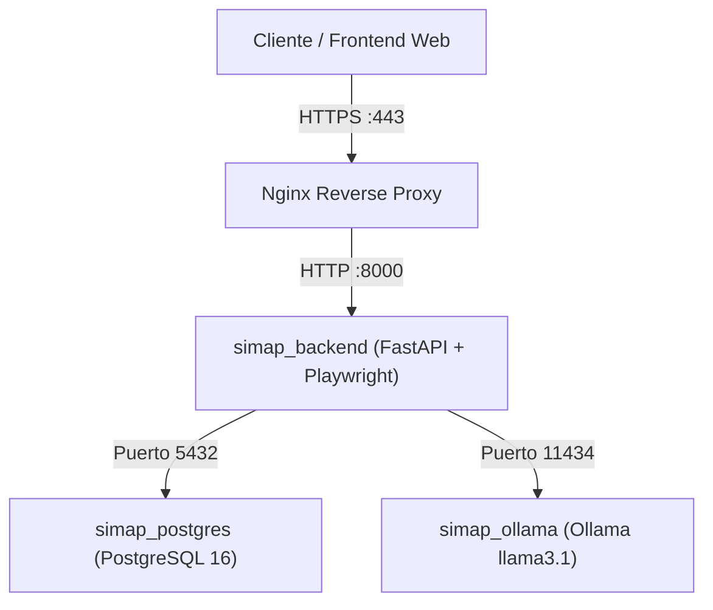

# ☁️ Guía de Despliegue en AWS (EC2 + Docker Compose)

Esta guía explica paso a paso cómo desplegar todo el sistema en una instancia de **Amazon Web Services (AWS EC2)** de forma autónoma, segura y escalable.

---

## 🏗️ Arquitectura en la Nube

Todo el sistema corre orquestado dentro de la instancia EC2 mediante **Docker Compose**:
1. **`simap_backend`**: API FastAPI + Playwright (Headless Chromium).
2. **`simap_postgres`**: Base de datos relacional con tablas `snapshots` y `analysis_reports` (`simap_db`).
3. **`simap_ollama`**: Microservicio local de inferencia con el modelo `llama3.1:latest`.
4. **`Nginx` (Opcional en Host)**: Proxy inverso con certificado SSL gratuito (Let's Encrypt / HTTPS).



---

## 1. Selección de la Instancia en AWS EC2

### Requisitos de Hardware
El modelo `llama3.1:latest` (8B) requiere aproximadamente **5 a 6 GB de RAM** para cargar en memoria, más los recursos para Chromium y PostgreSQL.

| Tipo de Instancia | vCPU | RAM | GPU | Propósito Recomendado | Coste Aprox. |
|---|---|---|---|---|---|
| **`t3.xlarge`** | 4 | 16 GB | No (CPU) | Excelente para pruebas, desarrollo y tráfico moderado | ~$0.166 / hora (~$120/mes) |
| **`c6i.xlarge`** | 4 | 8 GB | No (CPU optimizado) | Muy rápido en CPU para inferencias puntuales | ~$0.170 / hora |
| **`g4dn.xlarge`** | 4 | 16 GB | 16 GB (NVIDIA T4) | **Producción de alta velocidad** (inferencias en 2-4 segundos con GPU) | ~$0.526 / hora |

> [!TIP]
> **Recomendación para empezar**: Inicia con **`t3.xlarge`** (o `t3a.xlarge` con procesador AMD que es ~10% más económico).

### Configuración en la Consola de AWS:
1. **AMI**: Ubuntu Server 22.04 LTS o 24.04 LTS (64-bit x86).
2. **Almacenamiento (EBS)**: Mínimo **40 GB a 60 GB** en tipo `gp3` (para alojar Ubuntu, imágenes Docker y los 5 GB del modelo Ollama).
3. **Security Group (Reglas de Entrada / Inbound)**:
   - `SSH` (Puerto 22): Tu IP o `0.0.0.0/0`.
   - `HTTP` (Puerto 80): `0.0.0.0/0` (para tráfico web y renovación de certificados SSL).
   - `HTTPS` (Puerto 443): `0.0.0.0/0` (para acceso seguro con dominio).
   - `Custom TCP` (Puerto 8000): Si deseas acceder directamente sin Nginx.

---

## 2. Configuración del Servidor (Comandos Paso a Paso)

Conéctate por SSH a tu instancia:
```bash
ssh -i "tu-llave.pem" ubuntu@ec2-xx-xx-xx-xx.compute-1.amazonaws.com
```

### Paso A: Actualizar el Sistema e Instalar Docker
```bash
# 1. Actualizar repositorios
sudo apt update && sudo apt upgrade -y

# 2. Instalar paquetes requeridos
sudo apt install -y curl git ufw

# 3. Instalar Docker oficial
curl -fsSL https://get.docker.com -o get-docker.sh
sudo sh get-docker.sh

# 4. Dar permisos al usuario ubuntu para ejecutar Docker sin sudo
sudo usermod -aG docker ubuntu
newgrp docker

# 5. Verificar que Docker Compose esté disponible
docker compose version
```

---

### Paso B: Clonar el Repositorio y Configurar Variables
```bash
# 1. Clonar el proyecto
git clone https://github.com/TU_USUARIO/Backend.git
cd Backend

# 2. Crear el archivo .env de producción
cat << 'EOF' > .env
POSTGRES_USER=postgres
POSTGRES_PASSWORD=TuPasswordSuperSeguro123!
POSTGRES_HOST=db
POSTGRES_PORT=5432
POSTGRES_DB=simap_db

OLLAMA_BASE_URL=http://ollama:11434
OLLAMA_MODEL=llama3.1:latest
OLLAMA_TIMEOUT_SECONDS=180.0
EOF
```

---

### Paso C: Levantar los Servicios con Docker Compose
```bash
# Construir y levantar contenedores en segundo plano
docker compose up -d --build
```

Verifica que los tres contenedores estén en estado `Up`:
```bash
docker compose ps
```
Salida esperada:
```
NAME             IMAGE                  COMMAND                  SERVICE   STATUS
simap_backend    backend                "uvicorn app.main:ap…"   backend   Up (healthy)
simap_ollama     ollama/ollama:latest   "/bin/ollama serve"      ollama    Up
simap_postgres   postgres:16-alpine     "docker-entrypoint.s…"   db        Up
```

---

### Paso D: Descargar el Modelo en Ollama
Dado que es una instalación nueva en AWS, debes descargar el modelo `llama3.1:latest` dentro del contenedor de Ollama una sola vez (se guardará en el volumen persistente `ollama_data`):
```bash
docker exec -it simap_ollama ollama pull llama3.1:latest
```
*(Tardará un par de minutos dependiendo de la velocidad de conexión de la instancia EC2)*.

---

## 3. Configurar Dominio y HTTPS con Nginx (Recomendado para Producción)

Para que tu Frontend o usuarios puedan consumir la API de forma segura mediante `https://api.tudominio.com`:

```bash
# 1. Instalar Nginx y Certbot
sudo apt install -y nginx certbot python3-certbot-nginx

# 2. Crear configuración de Nginx
sudo nano /etc/nginx/sites-available/api_scraper
```

Pega el siguiente contenido (reemplazando `api.tudominio.com` por tu dominio o subdominio):
```nginx
server {
    listen 80;
    server_name api.tudominio.com;

    client_max_body_size 50M;

    location / {
        proxy_pass http://localhost:8000;
        proxy_http_version 1.1;
        proxy_set_header Upgrade $http_upgrade;
        proxy_set_header Connection 'upgrade';
        proxy_set_header Host $host;
        proxy_cache_bypass $http_upgrade;
        proxy_set_header X-Real-IP $remote_addr;
        proxy_set_header X-Forwarded-For $proxy_add_x_forwarded_for;
        proxy_set_header X-Forwarded-Proto $scheme;
        
        # Timeouts amplios para permitir scraping y generación de IA sin cortes
        proxy_read_timeout 300s;
        proxy_connect_timeout 300s;
        proxy_send_timeout 300s;
    }
}
```

Habilitar el sitio y reiniciar Nginx:
```bash
sudo ln -s /etc/nginx/sites-available/api_scraper /etc/nginx/sites-enabled/
sudo nginx -t
sudo systemctl restart nginx
```

Obtener certificado SSL gratuito de Let's Encrypt:
```bash
sudo certbot --nginx -d api.tudominio.com
```

¡Listo! Tu API estará disponible con HTTPS seguro en:
👉 `https://api.tudominio.com/docs`

---

## 4. Mantenimiento y Comandos Útiles

- **Ver logs en tiempo real:**
  ```bash
  docker compose logs -f backend
  docker compose logs -f ollama
  ```
- **Reiniciar servicios:**
  ```bash
  docker compose restart
  ```
- **Actualizar código fuente:**
  ```bash
  git pull
  docker compose up -d --build backend
  ```
- **Hacer copia de seguridad de la base de datos PostgreSQL:**
  ```bash
  docker exec -t simap_postgres pg_dump -U postgres simap_db > backup_$(date +%F).sql
  ```
